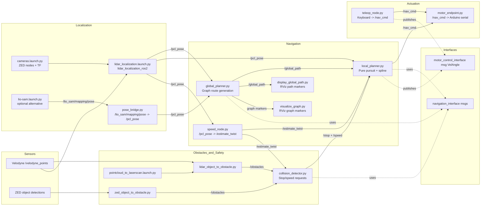

# ai-navigation
Comprehensive system architecture and file map for the JACart2 ROS 2 stack.

## 1) What this repository is
This workspace is a ROS 2 (Humble-style) multi-package system for autonomous and manual golf-cart control.

It combines:
- Localization (LiDAR + ZED camera stack)
- Global route planning on a directed graph map
- Local path tracking and steering command generation
- Obstacle conversion + collision checks + stop/speed mediation
- Motor endpoint that sends commands to the Arduino motor controller
- Teleop/manual control

## 2) System architecture (how components work together)

### High-level runtime diagram

## 3) Runtime sequence (end-to-end)
1. `cart_launch/autonomous_launcher.launch.py` starts the full stack: localization, navigation, motor control, RViz, rosbridge, and `swri_console`.
2. Localization publishes cart pose to `/pcl_pose` (directly from `lidar_localization_ros2` or via `pose_bridge` from LIO-SAM).
3. `speed_node.py` derives `/estimate_twist` from pose deltas.
4. `global_planner.py` receives pose + destination (`/clicked_point`) and computes a graph route from `.gml`, then publishes `/global_path`.
5. `local_planner.py` consumes `/global_path`, fits spline, runs pure-pursuit steering, and publishes `/nav_cmd` (`VelAngle`).
6. Obstacle pipeline (`zed_object_to_obstacle.py` and/or `lidar_object_to_obstacle.py`) publishes `/obstacles`.
7. `collision_detector.py` checks obstacle positions against projected turn arcs and publishes `/stop`/`/speed` when needed.
8. `local_planner.py` applies stop/speed constraints and updates `/nav_cmd`.
9. `motor_endpoint.py` translates `/nav_cmd` into serial packets for the Arduino controller and publishes `/heartbeat`.
10. If manual driving is desired, `teleop_node.py` can publish `/nav_cmd` directly.

## 4) Main launch compositions

### Full autonomous stack
- `cart_control/cart_launch/launch/autonomous_launcher.launch.py`
- Includes:
  - `localization_launch/localization_full_launcher.launch.py`
  - `navigation/launch/navigation.launch.py`
  - `motor_control/launch/motor.launch.py`
  - RViz profile `cart_control/cart_launch/rviz/localization.rviz`
  - `rosbridge_server`

### Navigation stack only
- `navigation/launch/navigation.launch.py`
- Starts:
  - `global_planner`, `local_planner`, `display_global_path`, `speed_node`, `visualize_graph`, `pose_bridge`
  - obstacle conversion launch
  - pointcloud-to-laserscan launch

### Simulation-only navigation stack
- `navigation/launch/sim_nav.launch.py`
- Adds:
  - `motor_simulator` (instead of real motor endpoint)
  - `global_tester` (injects test pose, target, speed, state)

### Motor stack only
- `motor_control/launch/motor.launch.py`
- `motor_control/launch/manual.launch.py` enables `manual_control` parameter.

## 5) Topic contracts (operationally important)

### Core planning topics
- `/pcl_pose` (`PoseWithCovarianceStamped`): canonical pose input for planners and speed estimator.
- `/global_path` (`LocalPointsArray`): route points from global planner to local planner.
- `/estimate_twist` (`TwistStamped`): estimated velocity used by local planner, collision detector, motor endpoint.
- `/estimated_vel_mps` (`Float32`): additional speed estimate source used in global/local planner logic.
- `/vehicle_state` (`VehicleState`): navigation state coordination.

### Command + safety topics
- `/nav_cmd` (`VelAngle`): final steering/speed command to motor endpoint.
- `/obstacles` (`ObstacleArray`): aggregated obstacles for collision checking.
- `/stop` (`Stop`): stop/resume requests from collision detector (and potentially other safety nodes).
- `/speed` (`Float32`): dynamic speed override requests.

### Visualization/support topics
- `/visual_path`, `/graph_visual`, `/target_point`, `/target_twist`, `/projected_path`, `/collision_pub`, `/boundaries_array`.

## 6) File-by-file map
Below is the practical role of each tracked source/config file (excluding `.git/*`).

### Root
- `README.md`: this architecture reference.
- `LICENSE`: repository license.
- `.gitignore`: ignored files and directories.
- `.gitmodules`: git submodule config placeholder.
- `shift_graph.py`: utility script to offset node positions in a `.gml` graph and write a shifted variant.

### `navigation/` package
#### Packaging + metadata
- `navigation/package.xml`: ROS package metadata/dependencies.
- `navigation/setup.py`: Python entry points for runtime nodes.
- `navigation/setup.cfg`: setuptools config.
- `navigation/README.md`: package-level usage notes.

#### Launch files
- `navigation/launch/navigation.launch.py`: primary navigation runtime launch.
- `navigation/launch/sim_nav.launch.py`: simulation/test launch for navigation.
- `navigation/launch/obstacle_conversion.launch.py`: starts obstacle converters + collision detector.
- `navigation/launch/pointcloud-to-laserscan.launch.py`: pointcloud conversion pipeline used by LiDAR obstacle node.

#### Graph/maps
- `navigation/maps/main.gml`: baseline directed road graph.
- `navigation/maps/main_shift.gml`: shifted graph variant.
- `navigation/maps/main_shift2.gml`: shifted graph variant.
- `navigation/maps/main_shift3.gml`: default graph used by launch files.
- `navigation/maps/home_loop.gml`: alternate map.
- `navigation/maps/EastCampusLiteV6.gml`: alternate map.

#### Runtime nodes and algorithms (`navigation/navigation/*.py`)
- `navigation/navigation/global_planner.py`: computes global route over graph from current pose to destination and publishes `/global_path`.
- `navigation/navigation/local_planner.py`: spline + pure-pursuit local tracking, consumes stop/speed requests, publishes `/nav_cmd` and status topics.
- `navigation/navigation/collision_detector.py`: computes collision envelopes from steering angle and obstacle set; publishes `/stop` and `/speed`.
- `navigation/navigation/lidar_object_to_obstacle.py`: converts LiDAR-derived scan clusters into `ObstacleArray`.
- `navigation/navigation/zed_object_to_obstacle.py`: converts ZED `ObjectsStamped` detections to `ObstacleArray`.
- `navigation/navigation/speed_node.py`: estimates velocity from `/pcl_pose` and publishes `/estimate_twist`.
- `navigation/navigation/pose_bridge.py`: bridges LIO-SAM pose topic into `/pcl_pose` format expected by planners.
- `navigation/navigation/display_global_path.py`: RViz marker publisher for global path.
- `navigation/navigation/visualize_graph.py`: RViz marker publisher for graph nodes/edges.
- `navigation/navigation/simulated_motor_endpoint.py`: simulation-only replacement for hardware motor endpoint.
- `navigation/navigation/test_global.py`: test node that publishes seed pose/state/target for global planner.
- `navigation/navigation/pure_pursuit.py`: pure-pursuit control math utility.
- `navigation/navigation/cubic_spline_planner.py`: spline interpolation utility.
- `navigation/navigation/steering_position_calc.py`: Ackermann steering kinematic helper used by simulator.
- `navigation/navigation/simple_gps_util.py`: GPS/local coordinate conversion and heading calibration helpers.
- `navigation/navigation/__init__.py`: Python package marker.

#### Additional artifacts in `navigation/navigation/`
- `navigation/navigation/drive_build.gml`: graph/build artifact.
- `navigation/navigation/frames_2025-04-10_17.39.11.gv`: TF/frame graph source snapshot.
- `navigation/navigation/frames_2025-04-10_17.39.11.pdf`: TF/frame graph rendered snapshot.

#### Legacy/reference resources
- `navigation/resource/global_planner.py`: ROS 1-era global planner reference.
- `navigation/resource/local_planner.py`: ROS 1-era local planner reference.
- `navigation/resource/zed_object_to_obstacleOG.py`: ROS 1-era ZED obstacle converter reference.
- `navigation/resource/requirements.txt`: Python dependencies for legacy/resource scripts.
- `navigation/resource/navigation`: ROS resource marker file.

#### Tests + tooling
- `navigation/test/test_flake8.py`: lint test.
- `navigation/test/test_pep257.py`: docstring style test.
- `navigation/test/test_copyright.py`: copyright header test.
- `navigation/test/visualize_path.rviz`: RViz profile for navigation testing.

### `motor_control/` package
#### Packaging + metadata
- `motor_control/package.xml`: ROS package metadata/dependencies.
- `motor_control/setup.py`: Python entry points for motor nodes.
- `motor_control/setup.cfg`: setuptools config.
- `motor_control/README.md`: motor package usage notes.
- `motor_control/LICENSE`: package-level license file.

#### Launch
- `motor_control/launch/motor.launch.py`: starts `motor_endpoint` with serial parameters.
- `motor_control/launch/manual.launch.py`: starts `motor_endpoint` with manual control toggle.

#### Runtime
- `motor_control/motor_control/motor_endpoint.py`: hardware actuation node; consumes `/nav_cmd`, performs brake/steer/speed logic, writes serial to Arduino, publishes `/heartbeat`.
- `motor_control/motor_control/motor_endpoint_test.py`: publishes test `VelAngle` commands for endpoint validation.
- `motor_control/motor_control/__init__.py`: Python package marker.

#### Resources
- `motor_control/resource/startup_script.sh`: environment/dependency setup script.
- `motor_control/resource/docker_startup_script.sh`: Docker-focused startup helper.
- `motor_control/resource/requirements.txt`: Python dependencies for setup scripts.
- `motor_control/resource/99-usb-serial.rules`: udev rules for serial device naming/permissions.
- `motor_control/resource/motor_control`: ROS resource marker file.

#### Tests
- `motor_control/test/test_flake8.py`: lint test.
- `motor_control/test/test_pep257.py`: docstring style test.
- `motor_control/test/test_copyright.py`: copyright header test.

### `teleop/` package
- `teleop/package.xml`: ROS package metadata/dependencies.
- `teleop/setup.py`: Python entry point for teleop node.
- `teleop/setup.cfg`: setuptools config.
- `teleop/README.md`: teleop usage notes.
- `teleop/teleop/teleop_node.py`: keyboard control node; publishes `VelAngle` to `/nav_cmd`.
- `teleop/teleop/__init__.py`: Python package marker.
- `teleop/resource/teleop`: ROS resource marker file.
- `teleop/test/test_flake8.py`: lint test.
- `teleop/test/test_pep257.py`: docstring style test.
- `teleop/test/test_copyright.py`: copyright header test.

### `navigation_interface/` package (custom navigation messages)
- `navigation_interface/package.xml`: package metadata.
- `navigation_interface/CMakeLists.txt`: message generation (`rosidl_generate_interfaces`) config.
- `navigation_interface/README.md`: message overview.
- `navigation_interface/LICENSE`: package license.
- `navigation_interface/msg/LatLongPoint.msg`: latitude/longitude/elevation point.
- `navigation_interface/msg/LatLongArray.msg`: list of GPS points.
- `navigation_interface/msg/LocalPointsArray.msg`: local coordinate path + total distance.
- `navigation_interface/msg/Obstacle.msg`: obstacle center/radius/followable flag.
- `navigation_interface/msg/ObstacleArray.msg`: list of obstacles.
- `navigation_interface/msg/Stop.msg`: stop request message (stop flag + sender + distance).
- `navigation_interface/msg/VehicleState.msg`: navigation state status.
- `navigation_interface/msg/WaypointsArray.msg`: NavSat waypoint list.

### `motor_control_interface/` package (custom command message)
- `motor_control_interface/package.xml`: package metadata.
- `motor_control_interface/CMakeLists.txt`: message generation config.
- `motor_control_interface/README.md`: interface overview.
- `motor_control_interface/msg/VelAngle.msg`: velocity + steering command used on `/nav_cmd`.

### `cart_control/cart_launch/` package
- `cart_control/cart_launch/package.xml`: package metadata.
- `cart_control/cart_launch/setup.py`: installs launch/RViz assets.
- `cart_control/cart_launch/setup.cfg`: setuptools config.
- `cart_control/cart_launch/README.md`: launch package overview.
- `cart_control/cart_launch/launch/autonomous_launcher.launch.py`: top-level autonomous launcher combining localization, navigation, motor, UI, and rosbridge.
- `cart_control/cart_launch/rviz/localization.rviz`: full-stack RViz configuration.
- `cart_control/cart_launch/autonomous_launch/__init__.py`: package marker.
- `cart_control/cart_launch/resource/cart_launch`: ROS resource marker file.
- `cart_control/cart_launch/test/test_flake8.py`: lint test.
- `cart_control/cart_launch/test/test_pep257.py`: docstring style test.
- `cart_control/cart_launch/test/test_copyright.py`: copyright header test.

### `cart_control/localization_launch/` package
#### Packaging + metadata
- `cart_control/localization_launch/package.xml`: package metadata.
- `cart_control/localization_launch/setup.py`: installs launch/config/param assets.
- `cart_control/localization_launch/setup.cfg`: setuptools config.
- `cart_control/localization_launch/README.md`: localization package overview.
- `cart_control/localization_launch/localization_launch/__init__.py`: package marker.
- `cart_control/localization_launch/resource/localization_launch`: ROS resource marker file.

#### Launch orchestration
- `cart_control/localization_launch/launch/localization_full_launcher.launch.py`: starts velodyne driver/transform + localization + camera stack.
- `cart_control/localization_launch/launch/lidar_localization.launch.py`: launches lifecycle-based `lidar_localization_ros2` node and supporting TF static transforms.
- `cart_control/localization_launch/launch/cameras.launch.py`: launches multi-camera setup and camera-to-base static TF.
- `cart_control/localization_launch/launch/zed_multi_camera.launch.py`: multi-camera container orchestration for ZED nodes.
- `cart_control/localization_launch/launch/zed_camera.launch.py`: single ZED wrapper/composable-node launch.
- `cart_control/localization_launch/launch/lio-sam.launch.py`: optional LIO-SAM localization pipeline launch.

#### Config/params
- `cart_control/localization_launch/param/localization.yaml`: lidar_localization_ros2 configuration.
- `cart_control/localization_launch/param/zed_multi.urdf.xacro`: multi-ZED URDF description and frame structure.
- `cart_control/localization_launch/config/common.yaml`: shared ZED camera runtime configuration.

#### Tests
- `cart_control/localization_launch/test/test_flake8.py`: lint test.
- `cart_control/localization_launch/test/test_pep257.py`: docstring style test.
- `cart_control/localization_launch/test/test_copyright.py`: copyright header test.

## 7) Operational modes

### Autonomous mode (typical)
1. Launch `ros2 launch cart_launch autonomous_launcher.launch.py`.
2. Provide destination via RViz `/clicked_point`.
3. Global planner emits route, local planner tracks route, motor endpoint actuates.
4. Obstacle stack can reduce speed or stop the cart.

### Manual/teleop mode
1. Launch motor endpoint in manual mode.
2. Run `teleop_node`.
3. Keyboard commands publish `VelAngle` directly to `/nav_cmd`.

### Offline/simulation mode
1. Launch `ros2 launch navigation sim_nav.launch.py`.
2. `motor_simulator` updates pose/speed topics in place of hardware.
3. `global_tester` injects test mission data.

## 8) Dependency boundaries
- Message contracts are isolated in `navigation_interface` and `motor_control_interface`; planning/control nodes depend on these, not each other’s internals.
- Launch packages (`cart_launch`, `localization_launch`) compose runtime behavior but do not implement planning logic.
- `navigation/resource/*` are legacy ROS 1 references and are not primary runtime paths.

## 9) Quick command reference
- Full autonomous stack: `ros2 launch cart_launch autonomous_launcher.launch.py`
- Navigation stack only: `ros2 launch navigation navigation.launch.py`
- Sim stack: `ros2 launch navigation sim_nav.launch.py`
- Motor only: `ros2 launch motor_control motor.launch.py`
- Manual teleop node: `ros2 run teleop teleop_node`

## 10) Notes for maintainers
- Current default graph in launch files is `main_shift3.gml`.
- Both ZED and LiDAR converters can publish to `/obstacles`; ensure frame expectations are consistent when running both.
- `pose_bridge.py` is needed when localization source is LIO-SAM (`/lio_sam/mapping/pose`) rather than direct `/pcl_pose` publishers.
- Tests are mostly style/lint checks; runtime behavior validation still depends on integration testing in launch contexts.
